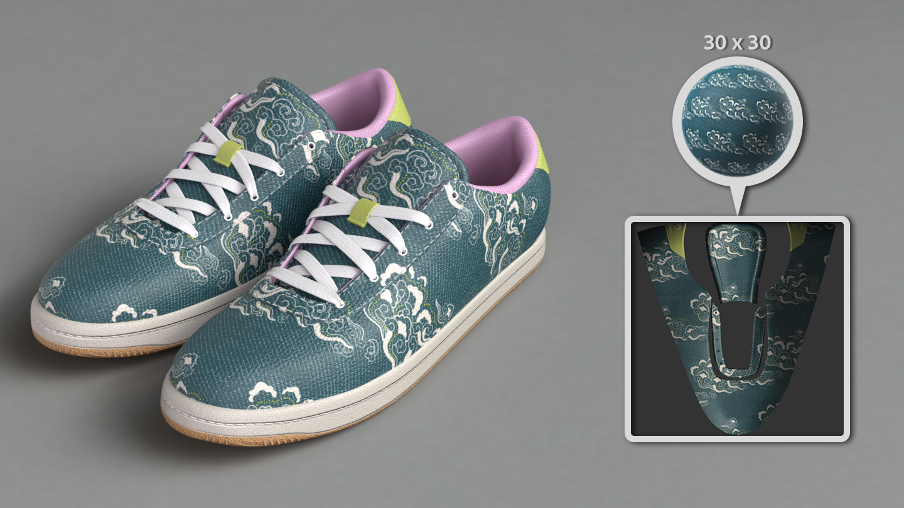

# Modo Conversión
La acción de convertir ahora tiene un modo dedicado con controles mejorados y la capacidad de girar alrededor de la malla durante la conversión. Haga clic en **Modo Conversión** en la barra de herramientas contextual para comenzar.

_ü

[more](https://substance3d.adobe.com/documentation/spdoc/baking-109608997.html)

# Informe del área de visualización al convertir
La nueva configuración de visualización le permite ver la jaula, la malla poligonal alta y la textura que esté convirtiendo en el área de visualización a la vez.

_ü

[more](https://substance3d.adobe.com/documentation/bake/substance-bakers-172818436.html)

# Configuración mejorada de convertidor
La gestión de convertidores mejorada le permite sincronizar o dividir ajustes como la resolución, la distancia de rayos y las mallas poligonales altas entre diferentes conjuntos de texturas.

_ü

[more](https://substance3d.adobe.com/documentation/bake/bakers-settings-172818452.html)

# Compatibilidad con USD
Cree un proyecto con el formato de archivo USD y sus atributos. Cuando vaya a exportar, puede enviar un archivo USD compatible con el archivo original.

_ü

[more](https://substance3d.adobe.com/documentation/spdoc/features-28737551.html)

# Tamaño físico para proyección UV
Las capas de relleno que utilizan la proyección UV ahora admiten la escala basada en el tamaño integrado de los materiales.

_ü

[more](https://substance3d.adobe.com/documentation/spdoc/uv-projection-180191757.html)