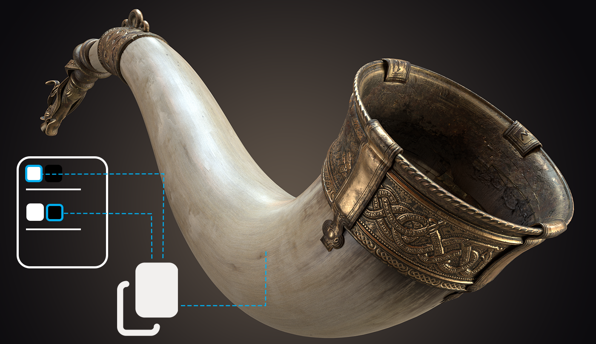

# ベイク処理モード
ベイク機能にコントロールが強化された専用モードが追加され、ベイク処理時にメッシュを中心軸として回転させることが可能になりました。コンテキストツールバーの「**ベイク処理モード**」をクリックして開始します。

[more](https://substance3d.adobe.com/documentation/spdoc/baking-109608997.html)

# ベイク処理時のビューポートフィードバック
新しい可視化設定では、ベイク処理中のケージ、ハイポリメッシュ、テクスチャを、直接ビューポートで同時に表示できます。

[more](https://substance3d.adobe.com/documentation/bake/substance-bakers-172818436.html)

# ベイカー設定の強化
ベイカー管理が強化され、解像度、光線距離、ハイポリなどの設定を、異なるテクスチャセット間で同期または分割できます。

[more](https://substance3d.adobe.com/documentation/bake/bakers-settings-172818452.html)

# USD サポート
USD ファイルの形式と属性を使用してプロジェクトを作成します。書き出し時には、元のファイルと互換性のある USD ファイルを出力できます。

[more](https://substance3d.adobe.com/documentation/spdoc/features-28737551.html)

# UV 投影の物理サイズ
UV 投影を使用する塗りつぶしレイヤーで、マテリアルの埋め込みサイズに基づくスケーリングがサポートされるようになりました。

[more](https://substance3d.adobe.com/documentation/spdoc/uv-projection-180191757.html)