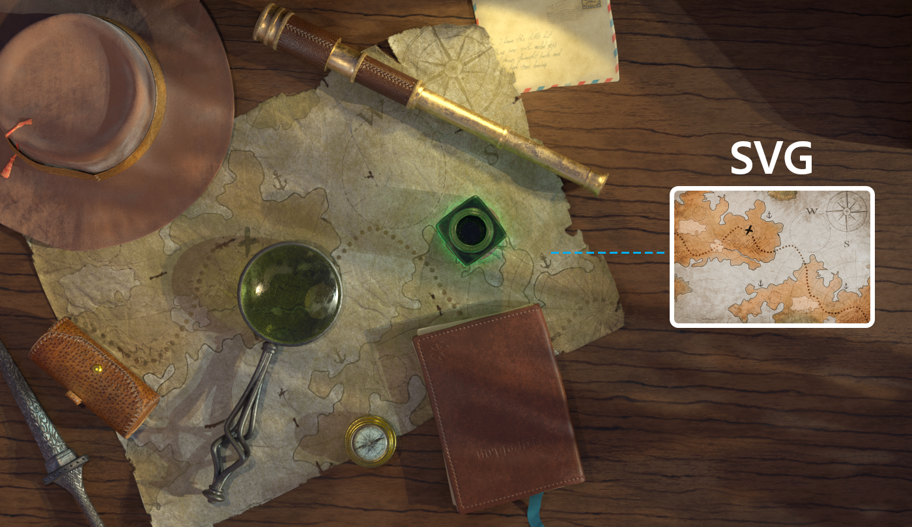
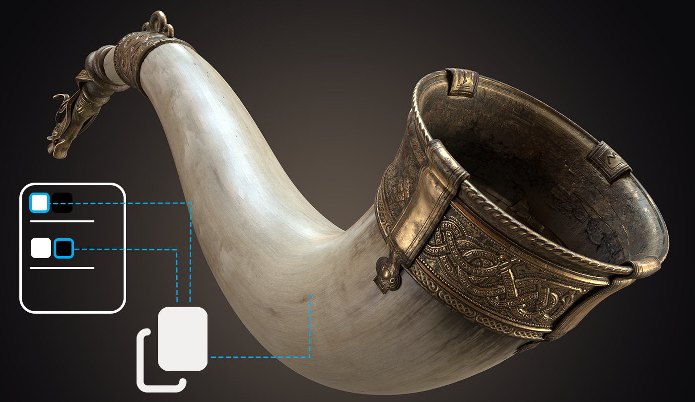
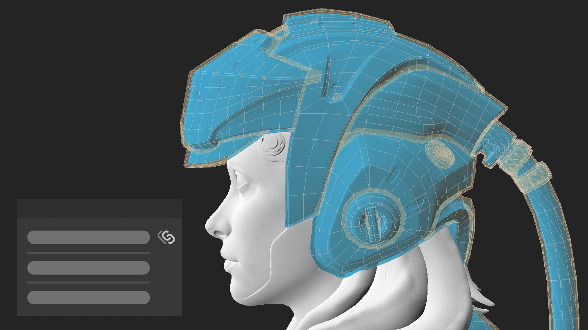

# SVG 파일 지원
SVG 파일을 사용하여 프로젝트의 벡터 이미지 속성에 액세스하면 자르기 영역, 해상도를 사용자 정의하고 파일의 레이어를 선택하여 €세부적으로™ 제어할 수 있습니다.

[more](https://helpx.adobe.com/substance-3d-painter/painting/vector-graphic-svg.html)

# 가져오기 및 드래그하여 놓기 개선
파일을 드래그하여 놓아 에셋을 가져오거나 필요한“ 위치와 관계없이 레이어 및 효과를 € 자동으로 만들거나 3D 개체에서 직접 만들 수 있습니다.

[more](https://helpx.adobe.com/substance-3d-painter/content/importing-assets/import-drag-and-drop.html)

# 투명도 지원
프로젝트에서 불투명도 및 기타 투명도 속성을 사용합니다. 새 샘플 프로젝트에서 어떻게 작동하는지 확인할 수 있습니다. **파일 > 샘플 열기 > 프랑스 레스토랑 테이블**.  

[more](https://helpx.adobe.com/kr/substance-3d-painter/interface/shader-settings.html)

# 경로 개선 사항
이제 경로를 따라 페인트하면 **사용자 정의 접선**을 활성화하여 정점의 접선을 편집하고 **패스 목록**에서 마우스 오른쪽 버튼으로 클릭하여 한 경로의 속성을 복사하여 다른 경로에 붙여넣을 수 있습니다.

[more](https://helpx.adobe.com/kr/substance-3d-painter/painting/tool-list/path.html)